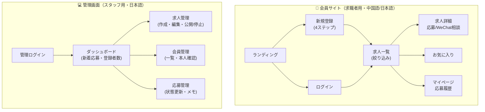
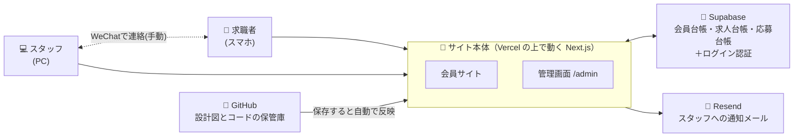
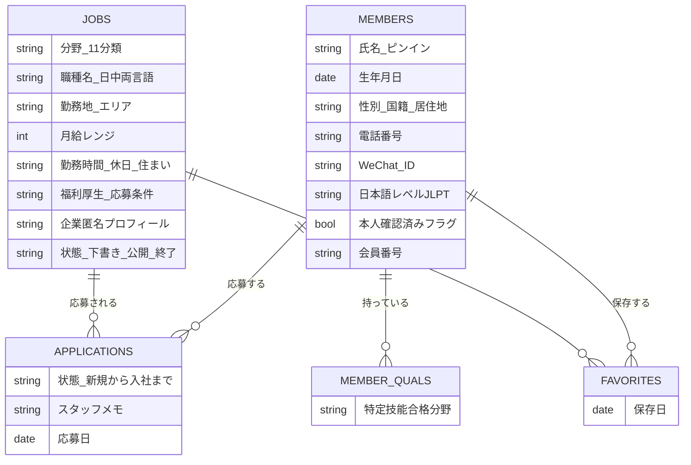
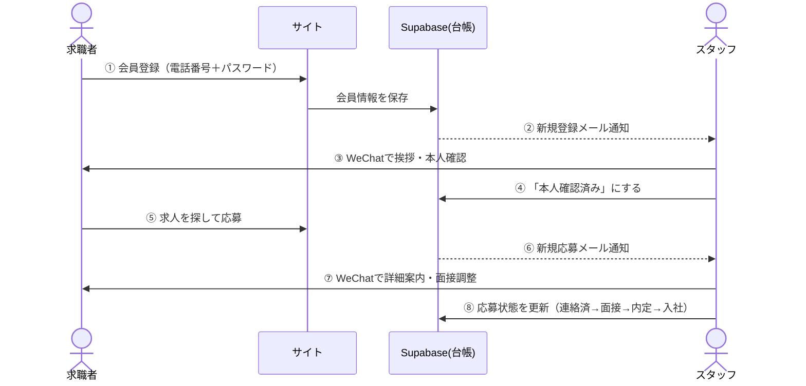
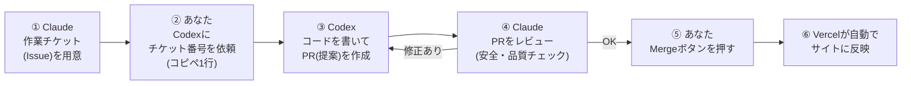
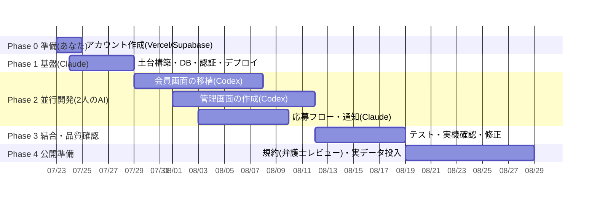

# 樱聘 YingPin β版 設計計画書

**作成日**: 2026年7月22日｜**対象**: 株式会社パートナー 中国人向け特定技能求人サイト
**この文書の目的**: モック（見た目の試作）を、実際に使えるβ版サイトにするための「設計図」と「進め方」を、専門知識がなくてもわかる形でまとめたものです。

> 📱 読みやすいビジュアル版もあります → `docs/beta-plan.html`（スマホ対応）

---

## 1. はじめに — モックとβ版は何が違うのか

| | モック（完成済み） | β版（これから作る） |
|---|---|---|
| 見た目・操作感 | ✅ ある | ✅ モックをそのまま使う |
| 登録した情報 | ❌ 保存されない（お試し） | ✅ 本当に保存される |
| ログイン | ❌ 誰でも入れる演出 | ✅ 本人だけ入れる |
| 求人の登録・編集 | ❌ できない（固定データ） | ✅ スタッフが管理画面から自由に |
| 応募の管理 | ❌ できない | ✅ 誰がどこに応募したか一覧・状態管理 |

つまりβ版とは、**モックの裏側に「金庫（データベース）」と「事務室（管理画面）」を付けたもの**です。

---

## 2. 完成形の画面マップ

- **会員側の7画面はモックがそのまま設計図**になります（作り直しではなく移植）
- **管理画面5画面が新規**で、ここがβ版の作業の約半分です

---

## 3. システム全体図 — どんな部品をつなぐのか

### 部品の役割（例え話つき）

| 部品 | 例えると | 役割 | 費用 |
|---|---|---|---|
| **Vercel** | 土地と店舗 | サイトを24時間公開しておく場所。コードを保存すると自動で最新版に | β中0円 → 公開後 約3千円/月（商用はPro必須） |
| **Next.js** | 店舗の建物 | サイト本体を作る道具（世界標準・AIが最も得意） | 無料 |
| **Supabase** | 金庫と台帳 | 会員・求人・応募のデータを安全に保管。ログインの鍵の管理も | β中0円 → 公開後 約3,800円/月 |
| **Resend** | 社内連絡係 | 「新しい応募がありました」をスタッフへメール通知 | 0円（月3,000通まで） |
| **GitHub** | 設計図の保管庫 | コードの置き場所。ClaudeとCodexの共同作業場 | 0円 |
| **WeChat** | 応接室 | 求職者との実際のやり取り（従来通りスタッフが手動。IDは台帳に記録） | 0円 |

> 🇨🇳 **中国からのアクセス対策**: 中国で使えないGoogle系の部品（Googleフォント・Google解析など）は最初から使いません。モックの時点で対応済みです。

---

## 4. データベース設計 — 台帳の中身

- モックの登録フォーム・求人カードの項目を**そのまま台帳の列にする**だけなので、迷う要素はありません
- 「本人確認済みフラグ」= スタッフがWeChatで本人確認したら管理画面でONにする欄（後述の認証方式とセット）

---

## 5. ログイン（認証）の方式

**β版は「電話番号＋パスワード」で開始します。**

- 登録時にSMS（ショートメッセージ）を送らないので、**追加費用ゼロ・最速**で始められます
- 中国の番号（+86）はSMSが届かないことがあるため、SMS認証に頼らない設計はむしろ安全です
- なりすまし対策は実務の流れでカバーします：**登録 → スタッフがWeChatで本人確認 → 管理画面で「確認済み」に** → 確認済みの人だけ応募を先に進める運用
- 将来SMS認証を足したくなったら、後から追加できる設計にしておきます（Supabaseのスイッチを入れてSMS会社と契約するだけ）

---

## 6. 応募データの流れ

WeChatでのやり取りは**今まで通りの人間の仕事**のまま。サイトは「集める・記録する・整理する」に徹します。

---

## 7. ClaudeとCodexの分担 — 2人のAIでの進め方

### 分担表

| 担当 | 作業内容 | 理由 |
|---|---|---|
| **Claude（私）** | 全体設計／データベースと安全設定（RLS）／ログイン認証／共通ルール整備／**CodexのPRレビュー**／結合テスト・品質保証 | 設計と安全性は一貫性が命。1人が持つべき領域 |
| **Codex** | モック画面のNext.js移植（一覧・詳細・お気に入り・マイページ）／管理画面の作成（求人・会員・応募）／中国語辞書の移行／単体テスト／細かい修正 | 仕様が明確な「量の多い」作業。使用量に余裕がある方に多く割り振る |

コード量の比率はおよそ **Claude 3.5 : Codex 6.5** の想定です（レビューと設計はすべてClaude）。

### 開発ループ — あなたの操作は3種類だけ

**あなたにお願いする操作は「依頼する・確認する・Mergeボタンを押す」の3種類だけ**です。コードを読む必要はありません。

### Codexへの依頼文（コピペ用テンプレ）

> GitHubの `codeakua/Job-Site-for-Specified-Skilled-Workers` を開いて、**Issue #◯◯** を読んでください。リポジトリ直下の **AGENTS.md** のルールに必ず従って実装し、`feature/issue番号-内容` のブランチでPRを作成してください。AGENTS.mdで禁止されている範囲（データベース定義・共通ルールファイル等）は変更しないでください。

### 2人のAIがぶつからないための仕組み

- **AGENTS.md**（Codex用）と **CLAUDE.md**（Claude用）に同じ開発ルールを書いておき、両者がそれを読んでから作業します
- チケットごとに**触ってよいフォルダを指定**（例：Codexは `app/src/app/admin/` だけ）→ 同じファイルを同時に触らないので衝突しません
- データベースの定義・共通ルールは**Claudeだけが変更**できます（家の土台を2人でいじらない）

---

## 8. 工程表 — β公開までの道のり

| フェーズ | 期間目安 | 内容 | 主担当 |
|---|---|---|---|
| **Phase 0** 準備 | 半日 | Vercel・Supabaseの無料アカウント作成（手順は私が案内） | **あなた** |
| **Phase 1** 基盤 | 2〜3日 | サイトの土台・データベース・ログイン・自動公開の配線 | Claude |
| **Phase 2** 並行開発 | 1〜2週間 | 会員画面の移植＋管理画面の新規作成を手分け | Claude＋Codex |
| **Phase 3** 結合・QA | 3〜5日 | 全体を通しで動作確認・スマホ実機テスト | Claude |
| **Phase 4** 公開準備 | 約1週間 | 利用規約（私がドラフト→顧問弁護士レビュー）・実求人データ投入・独自ドメイン | あなた＋Claude |

**β公開目標：8月末**（規約レビューの待ち時間次第で前後します）

---

## 9. 費用まとめ

| 項目 | β開発中 | 公開後（月額） |
|---|---|---|
| Vercel（サイトの土地） | 0円 | 約3,000円（Pro・商用必須） |
| Supabase（金庫と台帳） | 0円 | 約3,800円（Pro推奨） |
| Resend（通知メール） | 0円 | 0円〜 |
| ドメイン（サイトの住所） | ー | 年 約2,000円 |
| **合計** | **0円** | **月 約7,000円 ＋ 年2,000円** |

※ AIの利用料（Claude・ChatGPTのプラン費用）は別途。SMS認証を将来追加する場合はその時に従量費用。

---

## 10. リスクと対策

| リスク | 対策 |
|---|---|
| 中国からの表示速度・接続 | Google系部品を不使用（対応済み）。公開後に実測し、遅ければCDN（配信の高速化サービス）を追加 |
| +86へのSMSが届かない | β版はSMSを使わない方式を採用（本計画書 §5） |
| 利用規約・プライバシーポリシーのレビュー待ち | Phase 2の間に私がドラフトを作成し、先に顧問弁護士へ渡して並行で進める |
| 2つのAIの編集衝突 | チケットごとの担当フォルダ制＋土台はClaude専任（§7） |
| 中国在住者の直接募集の適法性 | サイトは「本人が自分の意思で登録・応募する」形。労働局届出と中国国内での宣伝方法の2点は顧問弁護士へ確認（確認結果を待たずにβ開発自体は進められます） |

---

## 11. 次のアクション

**あなたにお願いすること（Phase 0）**
1. https://vercel.com で無料アカウント作成（GitHubアカウントでログインを選ぶと簡単）
2. https://supabase.com で無料アカウント作成（同上）
3. 完了したら私に「アカウント作りました」と一言ください → Phase 1（基盤構築）を開始します
4. （並行でOK）サイトの住所（ドメイン名）の希望を考えておく（例：`yingpin.jp` / `ying-pin.com` など）

**私（Claude）がすぐやること**
- Phase 1 の基盤構築一式（この計画書の承認後）
- 利用規約・プライバシーポリシーのドラフト作成（Phase 2中に）

**作業チケット一覧**は `docs/tasks.md` にあります（GitHub Issuesにも同じものを登録し、Codexへの依頼はIssue番号で行います）。
