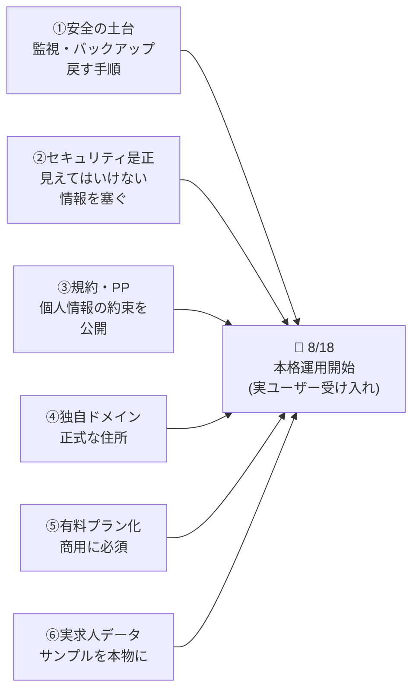
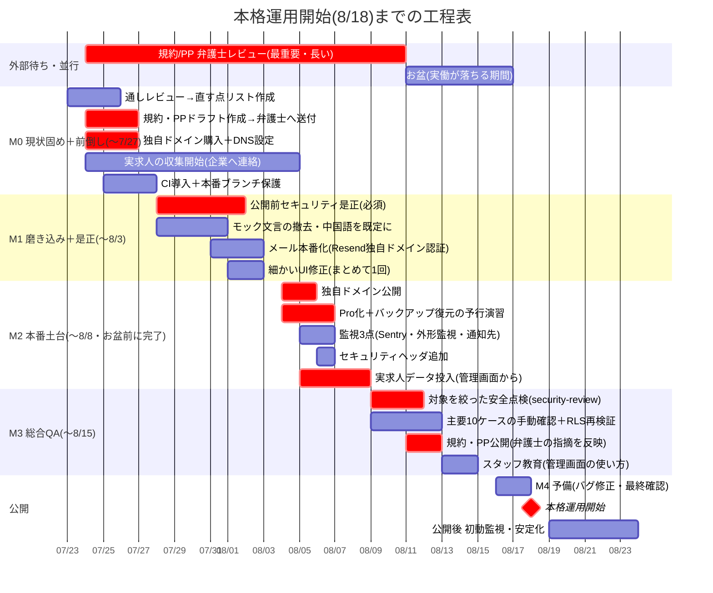
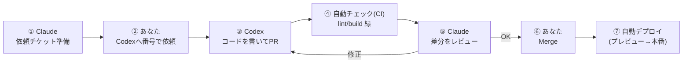

# 樱聘 YingPin ― 8月18日 本格運用開始 実行計画書

**作成日**: 2026年7月23日／**対象**: 株式会社パートナー 中国人向け特定技能求人サイト
**目的**: 現在ほぼ完成しているサイトを、**2026年8月18日に「本当のユーザーを受け入れて動かす」状態にする**ための、具体的で実行しやすい段取りを、専門知識がなくてもわかる形でまとめたものです。

> 📱 読みやすいビジュアル版 → `docs/launch-plan.html`（印刷・スマホ対応）／PDF版 → `docs/launch-plan.pdf`
> 🔎 この計画は、4名のAI専門レビュー（プロジェクト管理・セキュリティ/法務・技術/DevOps・AI活用）の指摘を反映した改訂版です。

---

## 0. まず1分で ― この計画の要点

- **良い知らせ**：サイトの「機能」はほぼ完成しています（登録・求人検索・応募・お気に入り・マイページ・管理画面の求人/会員/応募まで、すべて動いて本番稼働中）。
- **注意すべき点**：**「機能が動く」ことと「本当のお客様の個人情報を預かって公開できる」ことは別物**です。専門レビューで、公開前に必ず直すべき「土台」と「安全・法務」の宿題が見つかりました。
- **やること（8/18まで）**：残りの仕上げ（①安全の土台づくり ②公開前セキュリティ是正 ③規約・プライバシーポリシー ④独自ドメイン ⑤有料プラン化 ⑥実際の求人データ投入）を、**お盆（8/11〜16）前に前倒し**で片づけます。
- **進め方**：これまで通り **AIが実装、あなたは「依頼・確認・承認」** の3操作。使用量を節約する割り当て表（§4）も用意しました。
- **正直な見通し**：**「小さく開始（少人数＋実求人数社で静かに開始）」なら8/18は達成可能**。ただし宿題を"公開の合格ライン"として前倒しできるかが鍵です。間に合わない場合の最小構成も§11に用意しました。

---

## 1. いま、どこまでできているか

### ✅ 完成して動いているもの（本番稼働中）

| 区分 | 画面・機能 | 状態 |
|---|---|---|
| 会員（求職者）側 | 新規登録（4ステップ）・ログイン | ✅ |
| 会員側 | 求人一覧＋絞り込み（11分野・エリア・タグ・検索） | ✅ |
| 会員側 | 求人詳細・お気に入り・応募・WeChat相談 | ✅ |
| 会員側 | マイページ（登録情報・応募履歴・言語/テーマ切替） | ✅ |
| 通知 | 応募・新規登録のスタッフ宛メール（Resend） | ✅（本番で到達確認済） |
| 管理画面 | 求人管理（作成・編集・公開/停止） | ✅ |
| 管理画面 | 応募管理（6状態の更新・スタッフメモ） | ✅ |
| 管理画面 | 会員管理・本人確認フラグ | ✅（2026-07-23 完成・マージ済） |

**→ 画面・機能は「フルセット」そろいました。** 作り直しは不要です。

### ⚠️ でも「本番運用の準備度」はまだ低い（専門レビューの一致した評価）

機能がそろっていても、実際に公開して個人情報を預かるには、下の「土台」と「安全・法務」がまだ足りません。これが8/18までの本当の作業です。

- **土台（§8）**：自動チェック（CI）・本番用の安全なブランチ・**サイトが落ちても気づく監視**・**データのバックアップ**・**壊れた時に戻す手順** がまだ無い
- **安全（§9）**：会員が見えてはいけない情報が見える等の**実在の穴が2つ**（レビューで発見・確認済）／迷惑登録（bot）対策なし
- **法務（§12）**：**利用規約・プライバシーポリシーのページがまだ無い**（個人情報を集めるには公表が必須）
- **表示（§9）**：サイトに「これはモックです／サンプルです／定着率98%以上」といった**仮の文言が残っている**（実運用では不適切）
- **契約（§10）**：商用は**Vercel Pro・Supabase Proが必須**
- **中身**：掲載中の求人14件は**サンプル（ダミー）** → 実際の求人に入れ替えが必要

---

## 2. 「本格運用開始」とは、具体的に何をすることか

「本格運用開始」を、初心者にもわかるように分解するとこの6つです。

**「本格運用開始」＝ この6つがそろった状態で、独自ドメインのサイトに実際のユーザーが登録・応募できるようにし、それを安全に見守れる体制にすること。**

---

## 3. 全体スケジュール（8/18から逆算）

### ガントチャート

### マイルストーン一覧（言葉での説明）

| M | 期日 | 何をする | 主担当 |
|---|---|---|---|
| **M0 現状固め＋前倒し** | 〜7/27 | 全画面を実機で通しレビューし直す点をリスト化／**規約・PPの下書きを作って弁護士へ送る（返却期限も約束）**／**独自ドメインを買ってDNS設定**／実求人の収集開始／自動チェック(CI)と本番ブランチ保護を導入 | Claude＋あなた |
| **M1 磨き込み＋是正** | 〜8/3 | **公開前セキュリティ是正（§9の技術的な必須）**／モックの仮文言を消す・中国語を既定表示に／メール本番化／細かいUI修正をまとめて | Codex＋Claude |
| **M2 本番土台** | 〜8/8（お盆前に） | 独自ドメインで公開／**Vercel・Supabaseを有料プラン化しバックアップ復元を1回試す**／監視3点／セキュリティヘッダ／**実求人データを投入** | Claude＋あなた |
| **M3 総合QA** | 〜8/15 | 安全点検（範囲を絞って）／主要フロー10ケースを手動確認＋他人のデータが見えないか再検証／規約・PP公開／スタッフ教育 | Claude＋あなた |
| **M4 予備** | 8/16–8/17 | バグ修正・データ最終化・「戻す手順」を実際に一度試す | Claude＋あなた |
| **🚀 本格運用開始** | **8/18** | 最終チェック（Go/No-Go）→ 公開・受け入れ開始 → 初動を見守る | あなた |
| 安定化 | 8/19〜 | 監視・すばやい対応・第二陣へ拡大 | 全員 |

---

## 4. スケジュールの2大注意点 ― 「順番」と「お盆」

### ⛓ 依存関係（順番を守らないと詰まる作業）

一部の作業は「前が終わらないと次に進めない」直列のつながりです。ここを間違えると待ち時間が積み上がります。

- **メールの本番化チェーン**：`独自ドメインを買う → DNS設定 → Resendで独自ドメイン認証（メールの信頼設定 SPF/DKIM/DMARC・反映まで最大48時間）→ 送信元を自社ドメインに → 複数スタッフ宛に配信`
  → だから**ドメイン購入は「今週（M0）」に前倒し**が必須。今はメール送信元がテスト用で、**オーナー以外のスタッフには通知が1通も届きません。**
- **法務チェーン**：`規約・PPの下書き → 弁護士へ送付 → 返却 → 反映 → 公開`
  → **プライバシーポリシーの公開は、個人情報を集める本格運用の「前提条件」**。ここは最優先で先に動かします。

### 🎌 お盆（8/11〜16頃）が最終盤に重なる

日本のカレンダー上、**最終QA・予備日・弁護士の折り返し・実求人企業への連絡**がすべてお盆休みに重なります。ここを見落とすと"実働ゼロの1週間"になりかねません。

→ **対策：弁護士の返却・実データ投入・企業連絡を「8/8まで」に前倒し**。8/11〜16は予備＆軽作業の期間と位置づけます。

---

## 5. AI・エフォート割り当て ― 使用量を節約しながら進める

あなたは **Claude Max（賢いOpusが使える・枠多め）** と **ChatGPT Pro（Codexが主戦力）** をお持ちです。これを賢く配分して、品質を保ちつつ使用量を節約します。

### 考え方（2つの軸を分ける）

- **「賢さ」（Opus / Sonnet / Haiku）は"間違えたときの痛さ"で選ぶ** … 安全・設計・最終点検は一番賢いOpus。それ以外は標準のSonnetで十分。
- **「使用量（枠）」は"文脈の広さ × やり直し回数"で決まる**（重要度とは別） … 1行の修正確認はOpusでも激安。「全部を点検」のような無限定作業はどのモデルでも高い。**だから作業は小さく区切る。**
- **既定は Sonnet。モデル切替の判断をあなたに求めません** … 安全に関わる作業のときだけ、Claudeが「ここは慎重にやります」と一言添えて自分でOpusに上げます。

### 使用量を節約する7つのコツ

1. **依頼（チケット）を具体的に書く**（触る範囲・参照ファイル・完了条件）。→ AIが一発で成功し、**やり直し（＝使用量の倍消費）を防ぐ**。これが最大の節約。
2. **Codexへの依頼に「完了条件チェック」を必ず付ける**（下のテンプレ）。「できたつもり」の差し戻しを無くす。
3. **自動チェック（CI）を入れる** … GitHubに置くだけで、毎回の lint/build 確認をAIにやらせず自動化。**確認のたびに使っていた枠がまるごと不要に。**（費用対効果が最も高い）
4. **レビューは「変更点（差分）だけ」渡す** … 全部を読み直させない。
5. **1つの作業は1つの会話（セッション）で続ける** … 同じ会話なら読み込み済みファイルが再利用され、コストが約1/10に。
6. **文章・翻訳・下書き・手順調べは、ブラウザのChatGPT/Claudeで** … コーディング用の枠を使わずに済む。
7. **決めたことは `docs/` に記録** … 次の会話で同じ説明を繰り返さない（今の progress.md 運用を継続）。

### 作業ごとの割り当て表

| 作業 | 担当／賢さ | 想定使用量 | ひとこと |
|---|---|---|---|
| 公開前セキュリティ是正（安全の穴ふさぎ） | 実装=Sonnet or Codex／**最終点検=Opus** | 低 | 書くのは簡単、点検だけ慎重に |
| モック文言の撤去・実求人差替 | Codex→Claude確認 | 極低 | 辞書修正＋管理画面から投入 |
| 細かいUI修正 | **5件まとめて1回**（Codex or Claude直接） | 極低 | 1件ずつ依頼は往復のムダ |
| 中国語を既定表示に | 切替=ごく小さい／文章校正=ブラウザ | 低 | 本格的な辞書移行は公開後へ |
| メール本番化・独自ドメイン | 手順調べ=ブラウザ／設定=Claude小 | 低 | DNS操作はあなた |
| CI・監視・バックアップ導入 | Claude(Sonnet)＋あなたの設定 | 低〜中 | 一度きり・効果は継続 |
| **総合QA・最終安全点検** | 手動チェック=0／**範囲を絞った点検=Opus**／実機=あなた | Opus部分のみ高 | 「Opusで全部」を避け、要所だけに集中（枠を温存） |
| 規約・PP下書き | ブラウザで下書き→Claudeで整形→弁護士 | 低〜中 | 最終判断は弁護士 |
| 実求人データ投入 | **あなたが管理画面から**（Codexに作らせない） | 極低 | 実在の個人情報・企業データはコードに入れない |

### Codexへの依頼テンプレ（コピペ用・強化版）

> GitHubの `codeakua/Job-Site-for-Specified-Skilled-Workers` の **Issue #◯◯** を読み、リポジトリ直下の **AGENTS.md** と **app/AGENTS.md** に従って `feature/◯◯-内容` のブランチでPRを作成してください。**触ってよいフォルダ＝[Issueの範囲]**、**完了条件＝[Issueの完了条件]**。PRを出す前に自分で `cd app && npm run lint && npm run build` を通し、**スマホ幅(390px)で崩れない・中国語/日本語の両方・console.logを残さない**を確認し、**PR説明に「確認結果」としてチェックを1行ずつ**書いてください。データベース定義・共通ルール・モックは変更しないでください。

---

## 6. あなた（オーナー）がやることリスト（時系列）

コードを書く必要はありません。お願いするのは「依頼・確認・承認」と、いくつかの人手作業だけです。

**🔴 今週（M0）＝ 最優先の前倒し**
1. **独自ドメインを決めて購入**（例 `yingpin.jp`）。DNS設定は私が手順を案内します。
2. **顧問弁護士に「規約・プライバシーポリシーのレビューを8/8までにお願いしたい」と連絡**（下書きは私が用意）。
3. **最初に載せる実際の求人（数社ぶん）を決めて、企業から情報を集め始める**（お盆前に集めきる）。
4. 全画面をスマホで一度触ってみて、気になる点を私に伝える（直す点リスト化）。

**🟡 8月前半（M1〜M2）**
5. Vercel・Supabaseを**有料プラン（Pro）にアップグレード**（商用に必須。手順案内します）。
6. 集めた実求人を**管理画面から入力**（サンプル14件は削除）。
7. 監視サービスの通知先（あなたのメール）を登録。

**🟢 公開直前（M3〜M4）**
8. スタッフに管理画面の使い方を実演で共有。
9. 「壊れた時に前の状態へ戻す」操作を、私と一緒に一度試す。
10. Go/No-Goチェックリスト（§13）を一緒に確認 → 8/18公開。

---

## 7. 進め方 ― AIとの開発ループ（おさらい）

- **役割**：Claude＝設計・DB・安全・レビュー・最終点検／Codex＝画面や機能の実装（量）。
- **v2の改善**：**④の自動チェック(CI)を新設** … あなたは「緑チェック」を見てからClaudeにレビューを頼めるので、往復と使用量が減ります。

---

## 8. 運用基盤 ― 公開後に事故らないための土台（新規）

これは「サイトが動く」だけでは足りない、**"落ちても・壊れても立て直せる"** ための仕組みです。1人運営だからこそ必須です。

| 土台 | 何のため | やること |
|---|---|---|
| **本番ブランチの保護** | 壊れたコードが勝手に本番へ出るのを防ぐ | 本番＝保護された `main`。日々は別ブランチ→PR→プレビュー確認→合流。**本番へ直接書き込まない** |
| **自動チェック(CI)** | 壊れたまま公開されるのを防ぐ | GitHub Actionsで `lint & build` を自動実行。失敗したら合流できない |
| **監視3点** | サイトが落ちても気づく | **Sentry**（エラーをメール通知）＋**外形監視**（5分ごとに生存確認・落ちたら通知）＋通知先＝あなた |
| **バックアップ** | データを失わない | **Supabase Pro（毎日＋時点復元）は必須**。公開前に**一度復元を試して**手順を残す |
| **戻す手順（ロールバック）** | 公開日に問題が出ても復旧できる | Vercelの「1クリックで直前に戻す」操作を、あなたが一度練習しておく |
| **適用記録（台帳）** | 何をDBに適用済みか迷わない | 本番に流したSQLを順に記録する1枚を維持。サンプル求人の削除手順も明記 |

---

## 9. 公開前セキュリティ是正（必須）

専門レビューで見つかった、**公開前に必ず直す**項目です。★は私がデータベース設定を直接確認して"実在"を確かめたものです。

**技術で今すぐ直す（弁護士不要）**

- ★ **スタッフの内部メモが会員に見えてしまう** … 応募の「スタッフメモ」を、会員が自分の応募として直接読めてしまう状態。→ 会員から見えないように分離する。
- ★ **本人確認フラグを会員が自分で書き換えられる** … 「本人確認済み」の印を、会員自身がオンにできてしまう。これは（SMSを使わない本サイトで）唯一の本人確認の仕組みを無効化します。→ スタッフだけが変更できるように制限。
- **仮の文言を消す** … 「本サイトはデザイン確認用のモックです／掲載求人はサンプル／定着率98%以上（根拠要）」等が本番に残存。→ 撤去し、実データに差し替え（表示の適正化）。
- **迷惑登録(bot)対策** … 今は無制限に登録・通知メール送信ができる。→ 回数制限＋ワナ（honeypot）を追加（中国では画像認証が届かないことがあるため、サーバー側の回数制限を優先）。
- **管理鍵の誘発を消す** … 設定例ファイルに強力な管理鍵の記載が残っている。→ 削除し、公開時に「本番に管理鍵が無い」ことを確認。
- **パスワードの強度** … 最小文字数・漏洩パスワード拒否をサーバー側で有効化。ログイン試行の回数制限も。
- **管理操作の二重ガード**・**セキュリティヘッダ追加**・**ログインの不正転送対策**・**退会/削除に応じられる運用**。

これらは「あれば良い」ではなく **公開の合格ライン**です（§13のチェックリストに反映）。

---

## 10. 費用・契約

| 項目 | 開発中 | 公開後（月額） | 備考 |
|---|---|---|---|
| Vercel（サイトの土地） | 0円 | **約3,000円（Pro＝商用必須）** | 8/18前にアップグレード |
| Supabase（金庫と台帳） | 0円 | **約3,800円（Pro＝必須）** | 毎日バックアップ・個人情報保護のため |
| Resend（通知メール） | 0円 | 0円〜 | 独自ドメイン認証で複数宛先に |
| ドメイン（住所） | ー | 年 約2,000円 | 今週購入 |
| 監視（Sentry等） | 0円 | 0円〜 | 無料枠で開始 |
| **合計** | **0円** | **月 約7,000円＋年2,000円** | AI利用料は別（既契約の枠内で運用） |

---

## 11. リスクと対策（間に合わない場合の備えつき）

| リスク | 対策 |
|---|---|
| **お盆(8/11〜16)が最終盤に重なる** | 弁護士返却・実データ・企業連絡を**8/8まで**に前倒し。8/11〜16は予備に |
| **順番待ち（ドメイン→DNS→メール／規約→弁護士→公開）** | ドメイン購入と規約下書きを**今週**着手。反映待ち時間を工程に織り込む |
| **落ちても気づけない／データ喪失** | 監視3点＋Supabase Proバックアップ＋復元の予行演習 |
| **見えてはいけない情報・なりすまし** | §9の是正を公開の合格ラインに |
| **規約未公開のまま個人情報を集める** | プライバシーポリシー公開を"非交渉のGo条件"に |
| **中国から表示が重い/繋がらない** | Google系不使用済＋独自ドメイン＋公開後に実地測定 |

### もし全部が8/18に間に合わなかったら（最小構成での開始）

**死守するライン**：①プライバシーポリシー公開 ②§9の重大セキュリティ是正（★2件＋モック文言撤去＋bot対策）③バックアップ有効 ④実求人が数社。
**後回し可**：本格的な自動E2E・管理画面の作り込み(#16)・本格i18n移行・凝った監視。
→ この最小構成なら「静かなソフトローンチ」は安全に開始できます。無理に全部を詰め込んで品質を落とすより、**合格ラインを死守して小さく開始**が正解です。

---

## 12. 法務・コンプライアンス確認項目（顧問弁護士へ渡すチェックリスト）

> Claudeは下書き作成まで。最終判断は弁護士に委ねます。以下は「論点の提示」です。

- **個人情報保護法**：利用目的の公表（法21条）／第三者提供の有無／**委託先（Supabase・Vercel・Resend）の明記**／保管期間／開示・訂正・利用停止の窓口／苦情窓口 を**プライバシーポリシーの実ページ**に記載。
- **越境移転（法28条）**：まず技術側で**Supabaseの保管リージョンを確定**（東京か否か）→ 国名・その国の制度・安全管理措置を示して**同意取得**が要るか確認。
- **同意の取り方**：登録時に規約・PPへのリンク＋**同意した日時・版数の記録**で足りるか。
- **景品表示法**：「定着率98%以上」等の**数値の根拠**、モック/サンプル表記の撤去。
- **職業安定法（有料職業紹介）**：求人票の**労働条件明示**（受動喫煙防止措置など）、取扱職種の範囲・手数料（求職者は無償）・苦情処理体制の明示、実際の雇用主/就業場所を求職者へ明示するタイミング。
- **中国在住者の直接募集**の適法性（労働局届出・中国国内での募集方法）。
- **退会・データ消去請求**への対応水準（当面は管理側の手動対応でも可か）。

---

## 13. 公開当日 Go/No-Go チェックリスト

すべて「はい」になったら公開します。

- [ ] **プライバシーポリシー**が公開URLで見られ、登録の同意チェックから**リンク**している
- [ ] 会員から**スタッフメモが読めない**／会員が自分の**本人確認フラグを書き換えられない**（会員2人で実地検証）
- [ ] サイトに**「モック/サンプル」表記が無く**、掲載求人は**実データ**（サンプル14件は削除済み）
- [ ] 本番に**管理鍵が無い**／公開してはいけない秘密が無い
- [ ] **自動チェック(CI)が緑**・**本番ブランチが保護**されている
- [ ] **監視が動いていて、テスト通知があなたに届いた**
- [ ] **Supabase Proでバックアップ有効・復元の予行演習を1回完了**
- [ ] 登録フォームに**bot対策**があり、通知の連打で受信箱が溢れない
- [ ] **セキュリティヘッダ**あり・ログインの不正転送対策あり
- [ ] メール：独自ドメインの信頼設定（SPF/DKIM/DMARC）済み・複数宛先で到達確認
- [ ] Vercelの**「直前に戻す」操作をあなたが一度試した**・正常デプロイのIDを記録
- [ ] **スタッフが管理画面を使えると実演で確認**（既知の制限：会員のマイページ反映は次回開いた時）
- [ ] 実求人が**数社ぶん公開**・**中国からトップ〜応募まで到達**を確認
- [ ] 登録→応募→通知メール到達→管理で状態更新、の一連が**実機で通る**

---

## 14. 公開後の初動監視・ロールバック（サーキットブレーカー）

- **配信の固定**：公開当日の正常な状態（コミットID）を記録。異常時はVercelで**即・直前に戻す**。
- **初動チェック（公開後30分／24時間）**：①登録→応募→通知メール ②管理で状態更新 ③他人のデータが見えない、を実アカウントで確認。エラー監視も目視。
- **止める基準**：情報漏えいの兆候・ログインの破れ・応募が保存されない、のいずれかが起きたら**受付を一旦停止**（限定公開へ戻す）。

---

## 15. 公開後ロードマップ（安定したら）

- **#16 管理画面のPC最適化・機能拡充**（一覧のソート/検索/一括操作・ダッシュボード化）
- **本格的な多言語対応（T-11）**（辞書の本実装移行）
- **自動E2Eテスト**の整備（テスト用DB＋CIで、主要フローを毎回自動チェック）
- SMS認証の追加・中国向けの表示速度対策（CDN）・監査ログ・2要素認証 など

---

## 16. 用語ミニ辞典（初心者向け）

| 用語 | かんたん説明 |
|---|---|
| **本番運用** | お試しではなく、本当のユーザーの情報を預かってサイトを動かすこと |
| **ソフトローンチ** | 大々的に宣伝せず、少人数から静かに始める公開のしかた |
| **CI（自動チェック）** | コードを保存するたびに、機械が自動で「壊れていないか」を確認する仕組み |
| **ブランチ／本番ブランチ** | 作業用のコピー。本番ブランチ＝実際に公開される版 |
| **ロールバック** | 問題が出たとき、前の正常な状態にワンタッチで戻すこと |
| **監視（Sentry/外形監視）** | サイトのエラーや「落ちていないか」を見張り、異常を通知する仕組み |
| **バックアップ／復元** | データの控えを取り、万一のとき元に戻すこと |
| **RLS** | データベースの鍵。「自分のデータしか見られない」を保証する仕組み |
| **PP（プライバシーポリシー）** | 集めた個人情報を「何にどう使うか」を約束・公表する文書。個人情報を集めるなら必須 |
| **越境移転** | 個人情報が海外のサーバーに保管されること。本人への説明・同意が要る場合がある |
| **DNS／SPF・DKIM・DMARC** | 住所（ドメイン）とメールの信頼設定。迷惑メール扱いを防ぐ |
| **bot（ボット）対策** | 機械による大量の迷惑登録を防ぐ仕組み |
| **エフォート** | AIにどれだけ「賢さ/手間」をかけるか。高いほど正確だが使用量も増える |

---

*この計画書は、progress.md（現状の真実）とGitHubの実態、および4名のAI専門レビューに基づいて作成されています。日付・スコープは状況に応じて調整可能です。*
