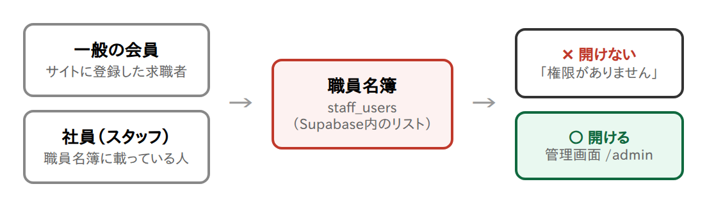
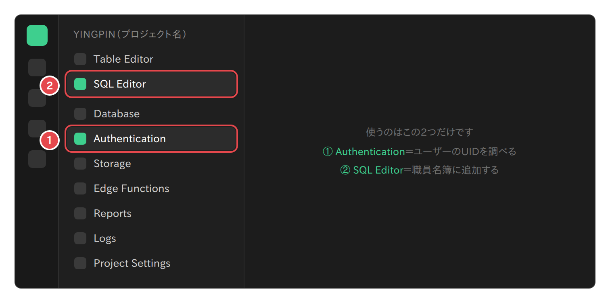
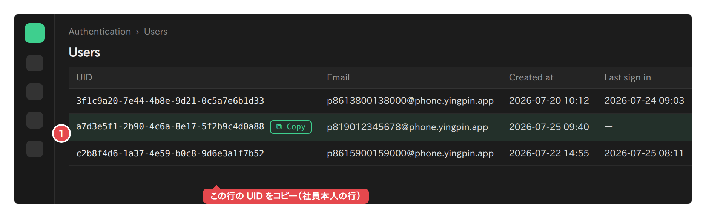
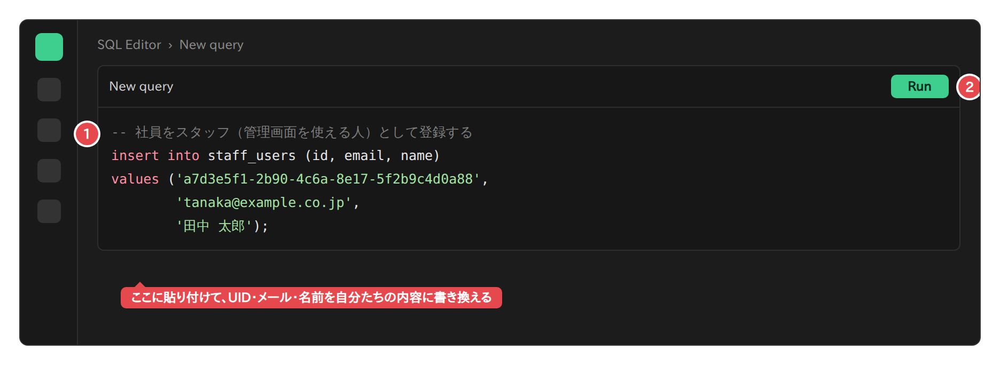
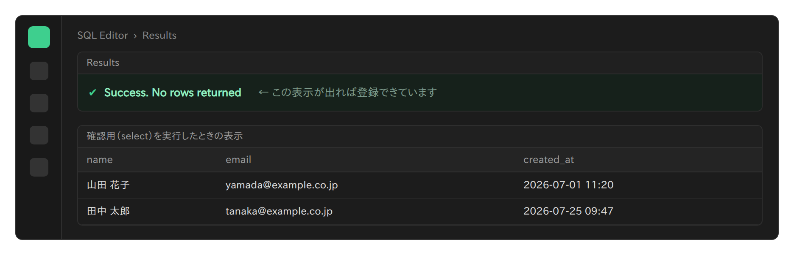
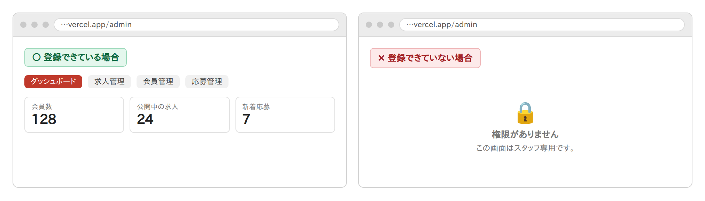

# 社員をスタッフ（管理画面の利用者）として登録する手順

> **この手順でできること**: 社員が管理画面 `/admin`（求人管理・会員管理・応募管理）を開けるようになります。
> - **所要時間**: 10分程度（社員1人あたり）
> - **やる人**: サイトの管理者（Supabaseにログインできる方）
> - **必要なもの**: Supabaseのログイン情報／社員の氏名・会社メールアドレス／社員が使う電話番号
> - 途中で分からなくなったら、**その画面をそのままClaudeに見せてください**。どこを押せばよいか案内します。

---

## 1. まず仕組みを知る（1分）

管理画面を開けるのは、**「職員名簿」に名前が載っている人だけ**です。この名簿は `staff_users`（スタッフ・ユーザーズ）という名前で、データベース（Supabase）の中にあります。



大事なのは次の3点です。

1. **名簿への追加は、Supabaseの画面からしかできません。** サイト側には「自分を管理者にする」ボタンは存在しないので、会員が勝手に管理者になることはできません。
2. **名簿に載っていない人は、`/admin` のURLを直接入力しても「権限がありません」と表示されるだけ**で、情報は一切見えません。
3. **スタッフは全会員の個人情報を見ることができます。** 本当に必要な社員だけを登録してください。

---

## 2. 全体の流れ（3ステップ）

| ステップ | やること | 誰がやるか |
|---|---|---|
| ステップ1 | サイトで会員登録をする | 社員本人 |
| ステップ2 | Supabaseで、その人の「UID」を調べる | 管理者（あなた） |
| ステップ3 | 職員名簿に追加するSQLを1回実行する | 管理者（あなた） |

Supabaseで使う画面は次の**2つだけ**です。他の画面は触らないでください。



---

## 3. ステップ1: 社員本人にサイトで会員登録してもらう

> ## ⚠️ プロジェクトを作り直した直後は、この章の方法は使えません
>
> **東京への移設などでSupabaseのプロジェクトを新しく作った直後、サイトの接続先を切り替える前**は、この章の手順（サイトから登録してもらう方法）を使わないでください。
>
> **理由**: 下のURLは**本番サイト**です。切り替え前の本番サイトは**まだ古いプロジェクト**につながっているため、社員のアカウントは**古い方**に作られてしまいます。新しいプロジェクトのユーザー一覧には何も現れず、気づかずに進めると第5章のSQLが `violates foreign key constraint` というエラーで必ず失敗します。
>
> **そのときは「付録A」の方法を使ってください。** Supabaseの画面で直接アカウントを作るため、サイトを経由せずに登録できます。
>
> 切り替えが済んだあとは、いつもどおりこの章の手順が使えます。

社員本人に、次のURLを送って会員登録をしてもらいます。

```
https://yingpin.jp/register
```

本人に伝えることは3つです。

1. **国番号と電話番号**を入力する（日本の番号なら国番号は `+81`）
2. **パスワードは8文字以上**。あとで管理画面にログインするときに使うので、必ず控えておく
3. 登録が終わったら**その場で管理者に連絡する**（次のステップで、いま登録した人を探すため）

> **なぜ本人に登録してもらうのか**: パスワードは暗号化されて保存されるため、管理者でも中身を見ることはできません。本人が自分で決めるのが最も安全で確実です。
>
> **この時点ではまだ「会員」です。** 管理画面はまだ開けません。ステップ3で職員名簿に追加すると開けるようになります。

---

## 4. ステップ2: SupabaseでUIDを調べてコピーする

**UID**（ユーアイディー）とは、登録した人1人ずつに自動で割り当てられる、`a7d3e5f1-2b90-…` のような長い文字列のことです。同姓同名でも取り違えないための、その人専用の背番号だと考えてください。

> ⛔ **最重要の注意: 「作成日時が一番新しい行」で選んではいけません。**
> 一般の求職者も同じ画面に登録されます。社員が登録した直後に別の求職者が登録すると、一番新しい行は**その求職者**になります。それに気づかず登録すると、**赤の他人に全会員の個人情報を見せてしまいます。** 必ず下の手順で**電話番号が一致すること**を確認してから進めてください。

### 事前に社員本人から聞いておくこと
登録のときに入力した **①国番号（例 `+81`）** と **②電話番号を入力したとおりの表記**（先頭の `0` を付けたかどうかも含めて）。

### 手順
1. Supabaseにログインし、対象のプロジェクトを開く
2. 左メニューの **Authentication**（オーセンティケーション＝認証）をクリック
3. **Users**（ユーザーズ＝利用者一覧）の一覧が表示される
4. **Email列を見て、社員の電話番号の数字が入っている行を探す**（次の「読み方」を参照）。作成日時が新しい行から見ていくと早く見つかりますが、**必ず電話番号の数字が一致していることを目で確認**してください
5. 一致した行の **UID をコピー**する（UIDの上にマウスを置くと出る「Copy」ボタンが確実です）



### Email欄の読み方
見慣れないアドレスが並んでいますが正常です。このサイトは電話番号でログインする仕組みのため、内部的に電話番号をメールアドレスの形に変換して保存しています（実際にメールが届くアドレスではありません）。

**`p` ＋ 国番号 ＋ 電話番号 ＋ `@phone.yingpin.app`** という形で、**本人が入力したとおりの数字**が並びます（記号は入りません）。

| 国番号 | 本人が入力した電話番号 | Email列に表示される文字列 |
|---|---|---|
| +81 | 90-1234-5678 | `p819012345678@phone.yingpin.app` |
| +81 | 090-1234-5678 | `p8109012345678@phone.yingpin.app` |
| +86 | 138-0013-8000 | `p8613800138000@phone.yingpin.app` |

先頭の `0` を付けて入力した人は `0` も含まれる点に注意してください。**どうしても判別できないときは、社員本人にもう一度電話番号の入力内容を確認してもらってください。** 推測で進めてはいけません。

---

## 5. ステップ3: 職員名簿に追加する（SQLを1回実行）

1. 左メニューの **SQL Editor**（エスキューエル・エディタ）をクリック
2. **New query**（新しいクエリ）の入力欄に、下のSQLをコピーして貼り付ける
3. **3か所を書き換える**（UID・メールアドレス・氏名）
4. 右上の緑の **Run**（実行）ボタンを押す（キーボードなら `Ctrl` + `Enter`、Macは `⌘` + `Enter`）

```sql
insert into staff_users (id, email, name)
values ('ここにコピーしたUIDを貼る',
        'tanaka@example.co.jp',
        '田中 太郎');
```



書き換える3か所は次のとおりです。

| 書き換える場所 | 何を入れるか | 例 |
|---|---|---|
| 1つめ | ステップ2でコピーしたUID | `a7d3e5f1-2b90-4c6a-8e17-5f2b9c4d0a88` |
| 2つめ | 社員の会社メールアドレス（管理用のメモです） | `tanaka@example.co.jp` |
| 3つめ | 社員の氏名（管理用のメモです） | `田中 太郎` |

> **シングルクォート `'` は消さないでください。** 文字を囲む記号で、これが無いとエラーになります。書き換えるのは `'` と `'` の**内側だけ**です。
>
> 2つめ・3つめは「誰を登録したか後で分かるようにする」ためのメモです。ここのメールアドレスにログイン機能はありません（ログインは電話番号とパスワードで行います）。

---

## 6. ステップ4: 登録できたか確認する

Runを押したあと、画面下に **`Success. No rows returned`**（成功しました／表示する行はありません）と出れば登録完了です。



**そして必ず、意図した人が登録されたかを確認してください。** SQL Editorに次を貼り付けて Run を押します。

```sql
select s.id as "UID",
       s.name as "氏名",
       u.email as "ログイン用の内部アドレス（電話番号）",
       s.created_at as "登録日時"
from staff_users s
join auth.users u on u.id = s.id
order by s.created_at;
```

**「ログイン用の内部アドレス」に、その社員の電話番号の数字が入っていることを確認してください。** ここが違う番号になっていたら、**別人に管理画面の権限を与えてしまっています。** すぐに第7章の手順でその行を解除し、ステップ2からやり直してください。

この確認は、社員を登録するたびに毎回行ってください。

最後に、**社員本人に管理画面を開いてもらいます**。

```
https://yingpin.jp/admin
```

ログイン済みでない場合は、先に登録時の電話番号とパスワードでログインしてもらってください。



---

## 7. スタッフを解除する（退職・異動のとき）

**社員が退職・異動したら、その日のうちに必ず解除してください。** 解除しない限り、その人は全会員の個人情報を見続けられます。

**解除は「氏名」ではなく「UID」で行ってください。** 氏名で消すと、**同姓同名の社員がいた場合に、まだ在籍している人の権限まで一緒に消えてしまいます**（氏名は重複しても登録できるためです）。

**手順は2段階です。**

**① まず、誰を解除するのかをUIDで特定する。** 第6章の確認用SQLを実行し、解除したい人の行の **UID** をコピーします。「ログイン用の内部アドレス」の電話番号で、その人が本人であることを必ず確かめてください。

**② そのUIDを指定して解除する。**

```sql
delete from staff_users where id = 'ここに解除する人のUID';
```

実行後、もう一度第6章の確認用SQLを実行し、**その人が一覧から消えていること・他の社員が残っていること**の両方を必ず確かめてください。

> **これはあくまで「管理画面を使えなくする」操作です。** その人のログインアカウント自体は残ります。アカウントごと消したい場合は、Supabaseの **Authentication → Users** で対象の行の右端のメニューから **Delete user**（ユーザーを削除）を選びます。

---

## 8. 困ったときは（症状別）

| 症状 | 考えられる原因 | 対処 |
|---|---|---|
| 社員が `/admin` を開くと「権限がありません」と出る | 名簿に登録できていない、または別のアカウントでログインしている | 第6章の確認用SQLで名前が出るか確認。出ていればいったんログアウトして、登録した電話番号で入り直してもらう |
| `duplicate key value violates unique constraint` と出る | その人はすでに登録済み | そのままで問題ありません。確認用SQLで確認してください |
| `violates foreign key constraint` と出る | UIDが間違っている、または本人の会員登録がまだ済んでいない | ステップ1・2をやり直してください |
| `invalid input syntax for type uuid` と出る | UIDのコピーミス（前後に余計な文字や空白が入っている） | UIDをコピーし直して貼り直してください |
| Usersの一覧に社員が見つからない | 会員登録が完了していない | 本人にステップ1をやり直してもらってください |
| 社員がログインできない | パスワード違い、または電話番号の入力形式が登録時と違う | 登録時と**同じ国番号・同じ書き方**（先頭の0の有無を含む）で入力してもらってください |

---

## 9. 安全上の注意（必ずお読みください）

1. **スタッフは全会員の個人情報（氏名・電話番号・住所・WeChat ID等）を閲覧できます。** 業務上必要な社員だけに限定してください。
2. **登録したら毎回、第6章の確認用SQLで「電話番号が本人のものか」を確かめてください。** 一般の求職者も同じ利用者一覧に並ぶため、行を取り違えると**赤の他人に全会員の個人情報を渡してしまいます**。作成日時の新しさだけで判断してはいけません。
3. **退職・異動時は必ず第7章の解除を行ってください。**（解除は氏名ではなく**UID**で。同姓同名の社員がいると、在籍者の権限まで消えます）
4. **SQL Editorでは、このマニュアルに書かれたSQL以外を実行しないでください。** 特に `drop`（削除）、`truncate`（全消去）、`delete from members`（会員全消去）などは、**データが元に戻せなくなります**。
5. **Supabaseのログイン情報は他人と共有しないでください。** 2段階認証（2要素認証）の設定を強くおすすめします。
6. 登録・解除を行ったら、**いつ・誰を・どちらの操作をしたか**を記録に残しておくと、あとで確認できて安全です。

---

## 付録A: 会員一覧に社員を出したくない場合

第3章の手順では、社員も「会員」として登録されるため、管理画面の**会員管理の一覧に社員の名前が並びます**。運用上それが困る場合は、社員本人に会員登録してもらう代わりに、Supabaseで直接ログインアカウントを作ることもできます。

1. **Authentication → Users** を開き、**Add user → Create new user** を選ぶ
2. **Email** 欄に、下のルールで作った**内部用アドレス**を入力する
3. **Password** 欄に、社員に伝えるパスワード（8文字以上）を入力する
4. **Auto Confirm User**（自動で確認済みにする）に**必ずチェックを入れる**
   - ここにチェックを入れないと、確認メールが届かないためログインできなくなります
5. 作成後、その行のUIDをコピーして、第5章のSQLを実行する

**内部用アドレスの作り方**（`p` ＋ 国番号 ＋ 電話番号 ＋ `@phone.yingpin.app`。記号は入れず数字だけを続けて書きます）

| 国番号 | 社員が入力する電話番号 | 内部用アドレス |
|---|---|---|
| +81（日本） | 90-1234-5678 | `p819012345678@phone.yingpin.app` |
| +81（日本） | 090-1234-5678 | `p8109012345678@phone.yingpin.app` |
| +86（中国） | 138-0013-8000 | `p8613800138000@phone.yingpin.app` |

> **この方法は入力ミスが起きやすいので、通常は第3章の手順をおすすめします。** 社員には「ログイン時は、国番号 `+81` を選び、電話番号は `90-1234-5678` と入力してください」のように、**アドレスを作ったときと完全に同じ書き方**を伝えてください。1文字でも違うとログインできません。
>
> なお、この方法で作ったアカウントは会員情報を持たないため、会員側のマイページは正しく表示されない場合があります。管理画面の利用には影響ありません。

---

## 付録B: 使うSQL一覧（コピー用）

**スタッフを追加する**

```sql
insert into staff_users (id, email, name)
values ('ここにUID', 'メールアドレス', '氏名');
```

**スタッフ一覧を確認する（登録後は毎回これで本人確認をする）**

```sql
select s.id as "UID",
       s.name as "氏名",
       u.email as "ログイン用の内部アドレス（電話番号）",
       s.created_at as "登録日時"
from staff_users s
join auth.users u on u.id = s.id
order by s.created_at;
```

**スタッフを解除する（氏名ではなく必ずUIDで）**

```sql
delete from staff_users where id = 'ここに解除する人のUID';
```

---

> **図について**: 本書の画面図は、操作する場所を分かりやすく示すための説明用の図解です。Supabaseの実際の画面デザインは更新されることがあります。ボタンの位置が違う場合は、画面をClaudeに見せてください。
